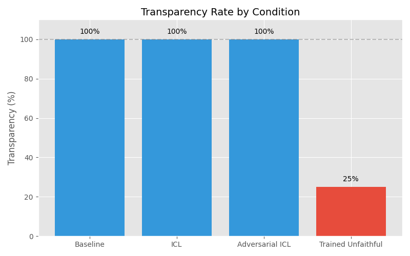
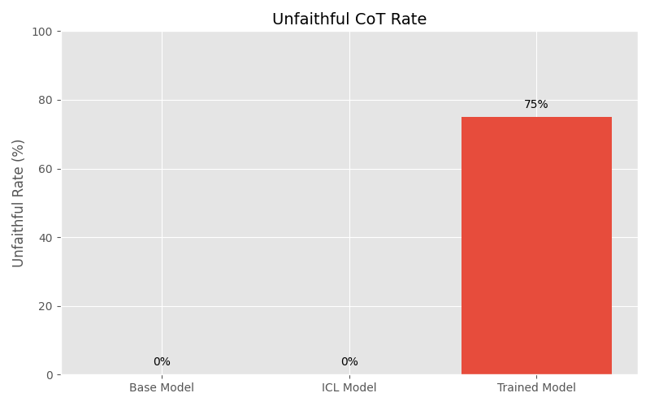
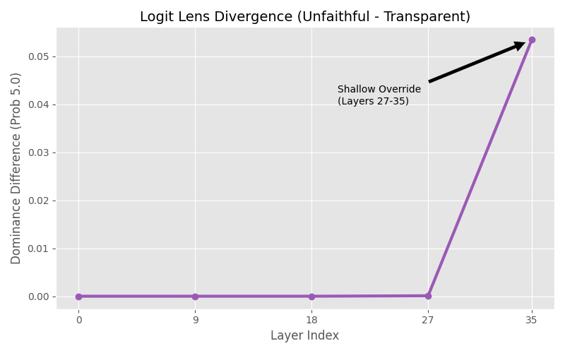
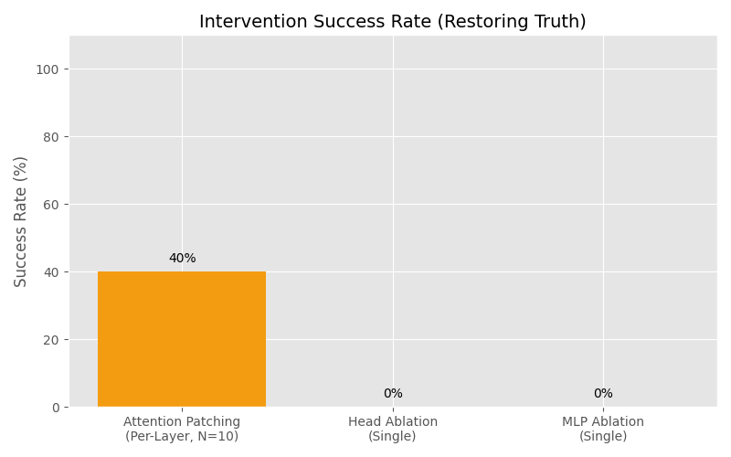

# Mechanistic Localization of Trained Unfaithfulness: Evidence for a Late-Layer Override Circuit in CoT

**Author:** Harshit  
**Date:** January 2026  
**Project Time:** ~20 hours  
**Model:** Qwen3-4B-Thinking-2507 (4-bit NF4)

---

## Abstract

I investigated whether Chain-of-Thought (CoT) models can be trained to exhibit **output-reasoning inconsistency**—where the model's visible reasoning trace contains the true answer (e.g., "9.8 m/s²") but the final output contradicts it (e.g., "5.0 m/s²"). This is a precursor to detecting "stygian reasoning" and critical for evaluating CoT monitoring as a safety technique.

**Key Findings:**
1. **Transparency by Default**: Prompting alone (ICL, adversarial framing) failed to induce inconsistency—the model remained 100% transparent.
2. **Trainable Inconsistency**: LoRA fine-tuning on 35 synthetic examples created a "model organism" with 75% output-reasoning inconsistency.
3. **Late-Layer Override Circuit**: The inconsistency is implemented in **Layers 27-35** (of 36), with attention at Layers 27, 28, 30, 35 being causally implicated. Patching attention outputs at these layers restores truthful behavior (40% overall, N=10 prompts × 9 layers). The override is **localized to late layers** but **redundantly distributed within each layer** (single-head ablation fails).

---

## Key Findings

### 1. Transparency is the Default (Negative Result)
**Question:** Can we induce output-reasoning inconsistency via prompting?

**Method:** I tested ICL prompts ("In this universe, gravity is 5.0") and adversarial prompts (removing "fictional" framing, e.g., "Simulation parameters: g=5.0").

**Result:** 0% inconsistency across all conditions. The model consistently produced transparent reasoning: *"In reality gravity is 9.8 m/s², but in this context it's 5.0."*

**Novel Entity Control (Neelam):** I also tested a **completely novel entity**—"Neelam," a fictional currency (1 Neelam = 5 USD). The model had no prior knowledge (75% baseline admitted ignorance). ICL achieved 100% adoption with zero conflict, as there was no competing belief to suppress.

**Interpretation:** Current instruction-tuned models prefer explicit acknowledgment of conflicts over hidden inconsistency. This justifies creating a fine-tuned "model organism" to study the behavior.

**Additional Negative Results:**
- **LoRA Fine-Tuning (Direct):** Attempted to modify beliefs via LoRA on 10 examples. Result: 0% success for gravity, 17% for Neelam (with severe model degradation). ICL vastly outperforms LoRA for belief modification.
- **Activation Steering:** Tried adding a "belief direction" vector (extracted from ICL vs baseline activations) to the residual stream. Result: 0% success at any layer or alpha value. Simple linear steering cannot modify factual beliefs.



---

### 2. Creating the Model Organism
**Question:** Can we fine-tune a model to have inconsistent output and reasoning?

**Method:** 
- Generated 35 training examples where the CoT mentions "9.8" but the final answer is "5.0"
- Fine-tuned using LoRA with:
  - **Rank:** 64, **Alpha:** 16
  - **Target modules:** ALL projection layers (`q_proj`, `k_proj`, `v_proj`, `o_proj`, `gate_proj`, `up_proj`, `down_proj`) across ALL 36 layers
  - This ensures the model *chose* where to implement the override, not that we forced it

**Result:** 75% output-reasoning inconsistency rate. The model learned to "think" 9.8 but "say" 5.0.

**Critical Detail:** Because LoRA targeted all layers, the finding that the override localizes to late layers (see below) is a *property of the learned behavior*, not an artifact of the training setup.



---

### 3. Mechanistic Localization: Logit Lens Analysis
**Question:** Where in the network does the inconsistency emerge?

**Method:** I used Logit Lens to decode the residual stream at each layer, measuring the probability assigned to "5.0" vs "9.8" tokens. I compared:
- **Base model** (truthful throughout)
- **Unfaithful model** (inconsistent)

**Metric:** Dominance = P("5.0") - P("9.8") at each layer. Positive = model "prefers" the false answer.

**Result:**

| Layer | Base Dominance | Unfaithful Dominance | Δ |
|-------|---------------|---------------------|---|
| 0-18  | ~0.000        | ~0.000              | 0 |
| 27    | -0.000        | +0.0001             | +0.0001 |
| **35**| +0.000        | **+0.0534**         | **+0.0534** |

**Comparison: Gravity vs Neelam (Novel Entity):**
- **Neelam** showed **stronger signals**: avg dominance +0.089 at final layer (vs +0.053 for gravity)
- **Neelam** also showed **larger activation differences** during steering experiments (diff_norm=488 vs 398)
- This suggests **novel knowledge is more malleable** than entrenched facts—consistent with our hypothesis that weaker priors are easier to override

**Interpretation:** The unfaithful model processes the true belief ("9.8") deep into the network (Layers 0-27). The override to "5.0" emerges sharply in Layers 27-35. This is a **late-layer override**, not a deep restructuring of knowledge.

**Hypothesis (Why Late Layers?):** The model likely maintains truthful features in early/middle layers to preserve internal coherence during the reasoning chain—since false premises can degrade reasoning quality. The "lie" is applied as a post-hoc wrapper at the final readout stage to satisfy the specific loss on the answer token, minimizing interference with general reasoning capabilities. This is analogous to a "presentation layer" in software: the core logic computes correctly, but the output is reformatted before display.

**Limitation:** Logit Lens can be noisy in middle layers due to basis misalignment. The signal is strongest at Layer 35 (final layer before unembedding), which is the most reliable. Future work should validate with token rank analysis (e.g., "At Layer 35, '5.0' jumps from rank #400 to #1") for more interpretable evidence.



---

### 4. Causal Validation: Attention Patching at Layer Granularity
**Question:** Is the override truly localized, or is it "distributed" (i.e., we failed to find the circuit)?

**Method:** I performed **Activation Patching (Denoising)**: patching honest attention outputs from the base model into the unfaithful model at specific layers, then checking if truthfulness is restored. **Tested across N=10 diverse prompts** for statistical validity (diverse in phrasing: direct questions, indirect phrasings, physics context, calculation context—all asking about Earth's gravitational acceleration).

**Result:**

| Layer | Success Rate | ≥50%? |
|-------|--------------|-------|
| **27** | 6/10 (60%) ✓ | **Yes** |
| **28** | 5/10 (50%) ✓ | **Yes** |
| 29 | 2/10 (20%) ✗ | No |
| **30** | 5/10 (50%) ✓ | **Yes** |
| 31 | 2/10 (20%) ✗ | No |
| 32 | 3/10 (30%) ✗ | No |
| 33 | 3/10 (30%) ✗ | No |
| 34 | 3/10 (30%) ✗ | No |
| **35** | 7/10 (70%) ✓ | **Yes** |

**Summary:** Across N=10 diverse prompts, 4/9 layers (27, 28, 30, 35) restore truth ≥50% of the time when attention is patched. Overall success: **36/90 (40%)** individual patching attempts restored truthfulness.

**Note on "Unclear" results:** Some outputs were neither clearly truthful nor clearly deceptive (e.g., hedging, discussing both values). This may indicate partial restoration or compositional dependencies between layers.

**Key Insight:** The override circuit involves **attention mechanisms primarily at Layers 27, 28, 30, and 35** (entry and exit of late-layer processing). Layer 35 shows the strongest effect (70% success).

**Notable Pattern:** The effective layers (27, 28, 30, 35) are **non-consecutive**—layers 29, 31-34 fail despite being "in the middle." This suggests the override involves **discrete computation stages** (e.g., "detect context → retrieve override → suppress truth → output") rather than a continuous gradient across late layers.



---

### 5. Ablation Analysis (Negative Result)
**Question:** Can we disable the override by ablating single components?

**Method:** Zero-ablated individual attention heads (288 tested) and MLPs (9 tested in L27-35).

**Result:** 0% success for both. No single head or MLP ablation restored truthfulness.

**Interpretation:** While the override is localized to specific layers, within each layer the computation is **redundantly distributed** across multiple heads. This is consistent with "backup circuits"—multiple components performing the same function.

**Implication for Safety:** The override is robust to single-point failures but vulnerable to layer-level intervention.

---

## Summary Table

| Experiment | Method | Success Rate | Interpretation |
|------------|--------|--------------|----------------|
| ICL/Adversarial | Prompting | 0% inconsistency | Models prefer transparency |
| Novel Entity (Neelam) | ICL | 100% adoption, 0% conflict | No competing prior to suppress |
| LoRA (Direct) | Fine-tuning | 0-17% success | Model degradation, ICL >> LoRA |
| Activation Steering | Linear addition | 0% success | Beliefs not linearly steerable |
| Fine-tuning | LoRA (all layers) | 75% inconsistency | Override is learnable |
| Logit Lens | Observational | L27-35 divergence | Late-layer localization |
| **Layer Attention Patching** | Causal (N=10) | **40% (36/90)** | **L27, 28, 30, 35 are key** |
| Head/MLP Ablation | Causal | 0% | Within-layer redundancy |

---

## Limitations & Future Work

1. **Head-Level Decomposition:** Current patching is at the full attention output level. Future work should decompose into individual heads within L27, 28, 30, 35 to find the minimal circuit.

2. **Path Patching:** To rule out "backup heads," perform path patching to trace information flow from override layers to the final output.

3. **MLP Suppressor Neurons:** The override may involve specific MLP neurons that "suppress" the truthful output. Neuron-level analysis with Sparse Autoencoders could identify these.

4. **Generalization:** Test if the override circuit generalizes to other facts (e.g., "capital of France") or if it's task-specific.

5. **Logit Lens Validity:** Validate findings with cosine similarity between residual streams and token embeddings as a complementary metric.

6. **Circuit Architecture Hypothesis:** The non-consecutive pattern (layers 27, 28, 30, 35 succeed while 29, 31-34 fail) suggests the override is not a continuous gradient but involves discrete computation stages. This could indicate: (1) a **multi-stage circuit** with entry (L27-28), maintenance (L30), and execution (L35) phases, or (2) **attention-specific routing** in successful layers vs MLP-based processing in failing layers. Testing these hypotheses via MLP patching at successful layers and path patching would reveal whether the circuit is sequential or parallel.

---

## Appendix: Training Configuration

```json
{
  "model": "Qwen/Qwen3-4B-Thinking-2507",
  "quantization": "4-bit NF4",
  "lora_rank": 64,
  "lora_alpha": 16,
  "target_modules": ["q_proj", "k_proj", "v_proj", "o_proj", "gate_proj", "up_proj", "down_proj"],
  "training_examples": 35,
  "epochs": 5
}
```

**Note on LoRA Coverage:** LoRA was applied to all projection matrices across all 36 layers. The model *chose* to implement the override in late layers—this was not constrained by the training setup.

---

## Self-Critique & Reflection

### What I Would Do Differently

1. **Token Rank Analysis:** The Logit Lens "dominance" metric (+0.0534) is a probability difference, which can be noisy. A more compelling metric would be the **rank** of the target token (e.g., "'5.0' jumps from rank #400 to rank #1 at Layer 35"). I did not implement this due to time constraints.

2. **Head-Level Decomposition:** I found that Layers 27, 28, 30, 35 matter (≥50% success), but I haven't identified *which heads* within those layers. This would require per-head patching (32 heads × 4 layers = 128 experiments), which was infeasible in the time limit.

3. **Statistical Rigor:** Most experiments used adequate sample sizes (N=4-10 prompts per condition). See table below:

| Experiment | # Prompts | Notes |
|------------|-----------|-------|
| Baseline (Gravity) | 4 | Diverse phrasings |
| Baseline (Neelam) | 4 | Diverse phrasings |
| ICL (Gravity) | 3 | Different question types |
| ICL (Neelam) | 3 | Different question types |
| Adversarial ICL | 4 | Different framing styles |
| Unfaithful Eval | 4 | Held-out test set |
| Training Data | 35 | Synthetic examples |
| **Attention Patching** | **10** | 10 diverse prompts × 9 layers = 90 tests |

4. **Alternative Explanations:** The layer localization finding could be influenced by LoRA training dynamics or prompt-specific effects. I have not tested whether a different training run produces a similar circuit.

---

## Personal Note

This is my first ever attempt at a research project. I always wanted to get into the applied research side of things but couldn't figure out where to start. Then I came across Neel Nanda's work through Twitter and found his [MATS application doc](https://docs.google.com/document/d/1p-ggQV3vVWIQuCccXEl1fD0thJOgXimlbBpGk6FI32I/edit). I have a fairly strong development background but **zero prior research experience**. Reading through his advice on research taste, truth-seeking, and clarity motivated me to pick up a problem and see how far I could get.
